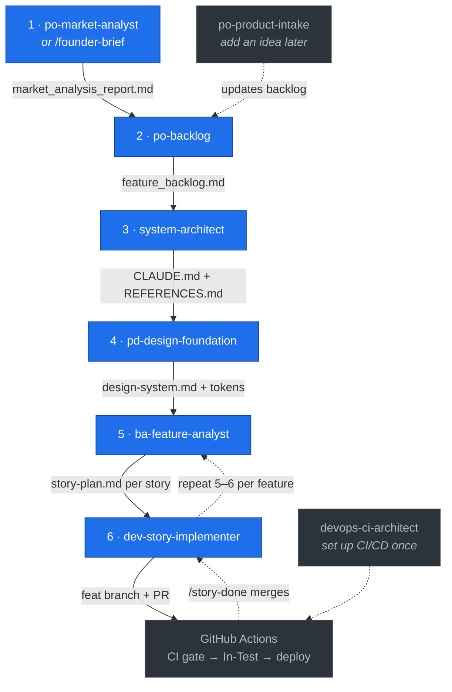

# product-pipeline

**A Claude Code plugin that takes a product from idea → shipped, reviewed code — one guided step at a time.**

You talk to Claude in plain language (*"research this app store niche"*, *"create the backlog"*, *"set up the project"*, *"implement S-03"*). The right **skill** activates, asks a few questions, and writes its output to your repo's `docs/` folder. Heavy or repetitive work is delegated to purpose-built **subagents** so your main session stays fast and focused. An optional **GitHub Projects** board and a per-stack **CI/CD pipeline** turn each story into a PR, a merge-gated build, and a deploy — automatically.

Works for **iOS apps**, **web SaaS** (Angular/React front-end + Node.js/TypeScript API monorepo), and **Shopify apps** — and is extensible to other stacks via drop-in template directories.

---

## Why it's different

- **One conversation, end to end.** Each step reads what the previous one wrote (`docs/*.md`), so you never copy specs around by hand.
- **Context-lean by design.** Noisy or fan-out work (competitor research, backlog audits, per-feature/-story drafting, code review, GitHub I/O) runs in subagents that return only distilled results — your main context holds work, not noise.
- **The pipeline enforces quality.** CI is a *real* merge gate (branch protection), every workflow runs least-privilege, and every story gets an independent code review before it merges.
- **Design in the loop.** UI stories can hand off to **[Claude Design](https://www.anthropic.com/news/claude-design-anthropic-labs)**: the plugin writes you an on-brand prompt, you design visually, drop the export back, and the implementer builds against it.

---

## The pipeline

Run the steps in order — each produces a file the next one reads. Example phrases are what you actually type to Claude.



| # | Say something like… | What runs | What you get |
|---|---|---|---|
| 1 | *"Analyze the app store for kids reading apps"* — or *"I have an idea: …"* | **po-market-analyst** (App Store research) **or** **/founder-brief** (any product type) | `docs/market_analysis_report.md` |
| 2 | *"Create the backlog"* | **po-backlog** | `docs/feature_backlog.md` — prioritized features + personas |
| 3 | *"Set up the project"* | **system-architect** | Picks the stack, scaffolds folders + toolchain, `git init`, writes `CLAUDE.md` + `docs/REFERENCES.md` |
| 4 | *"Create the design system"* | **pd-design-foundation** | `docs/design-system.md` + a platform tokens file your UI imports |
| 5 | *"Break down feature F-002"* | **ba-feature-analyst** | One folder per feature with self-contained, testable story files |
| 6 | *"Implement S-03"* | **dev-story-implementer** | Code for that one story — verified, independently reviewed, committed on a feat branch, pushed |
| + | *"set up CI"* (once) | **devops-ci-architect** | GitHub Actions matched to your stack — the merge gate + deploy |

Repeat steps 5–6 per feature. That's the core loop. Add an idea anytime with **po-product-intake** (*"I want to add a referral feature"*).

---

## What happens after `dev-story-implementer` pushes

The implementer commits on a `feat/**` branch (with `Closes #N`) and pushes — then GitHub Actions takes over:

1. **`auto-pr.yml`** opens the PR.
2. **`ci.yml`** runs build + test — the **required check** (enforced by branch protection; a red PR can't merge).
3. On green, **`in-test.yml`** moves the board to **In-Test** and runs the stack's on-green delivery.
4. You test the build, then run **/story-done** → it verifies CI is green, squash-merges, and sets the board to **Done**.
5. **`release.yml`** (where the stack has one) ships on merge.

**Per-stack delivery:**
- **iOS** — choose `local-simulator` (CI verifies; install locally with `scripts/run-on-sim.sh`) or `testflight` (CI uploads each green story to TestFlight before In-Test). Override per-PR with a `deliver:testflight` / `deliver:local` label.
- **Shopify** — `in-test.yml` deploys an unreleased preview (`--no-release`); `release.yml` releases on merge.
- **Web SaaS (`saas-cloud`)** — host-agnostic: CI + DB migrations are wired; the host deploy lives in a `release.yml` USER CUSTOM block you fill (Vercel / Fly / Railway / …).

---

## Claude Design integration (UI stories)

When a story is flagged `Design: required` and has no design yet, **dev-story-implementer** pauses and offers to help:

1. It delegates to the **`design-prompt-writer`** subagent, which writes a Claude-Design-ready `PROMPT.md` into the story's `design/` folder — grounded in *your* `design-system.md` + tokens (so the result is on-brand).
2. You open **Claude Design**, point it at your repo, paste the prompt, and export the **standalone HTML + handoff bundle** into `design/`.
3. Re-run the implementer — it now builds against the design (component structure + tokens), treating your repo tokens as the source of truth.

For web, the bundle maps near-directly to components; for iOS/Shopify it's a visual reference the implementer rebuilds natively.

---

## Architecture

```
.claude-plugin/plugin.json   — plugin manifest
skills/                      — 8 pipeline skills (one SKILL.md + templates each)
agents/                     — 9 purpose-built subagents (read-only or single-job)
commands/                   — 5 slash commands (/founder-brief, /board-init, /story-start|test|done)
settings.json               — plugin settings
```

**Skills** are the steps you drive. **Subagents** are where the plugin keeps your context clean — each does one narrow job and returns a tight, structured result:

| Subagent | Job | Model | Used by |
|---|---|---|---|
| `competitor-researcher` | One App Store competitor profile (parallel) | haiku | po-market-analyst |
| `backlog-auditor` | Read the whole backlog once → schema/dup/dep/conflict report | inherit | po-product-intake |
| `feature-drafter` | One feature's backlog detail block (parallel) | haiku | po-backlog |
| `codebase-scanner` | Brownfield recon + touch-points/contract drift audit | haiku | ba, dev |
| `story-plan-writer` | One self-contained `story-plan.md` (parallel) | inherit | ba-feature-analyst |
| `design-prompt-writer` | Claude-Design prompt for a UI story | sonnet | dev-story-implementer |
| `code-reviewer` | Independent post-implementation review | sonnet | dev-story-implementer |
| `github-projects-helper` | Project v2 field/status reads + one status mutation | haiku | ba, dev, commands |
| `story-publisher` | Batch-publish a feature's stories as Issues | haiku | ba-feature-analyst |

Adding a project type is a **drop-in directory** — no skill edits:
- a CI/CD stack → `skills/devops-ci-architect/templates/stacks/<id>/` (see its `new-stack/HOWTO.md`)
- a scaffold template → `skills/system-architect/templates/<id>.md`

---

## The optional GitHub board

If you want every story tracked as a GitHub Issue on a Projects (v2) board:

1. When **po-backlog** finishes, say **yes** to set up a project (or run **/board-init** later). It creates the project and wires it into `feature_backlog.md`.
2. From then on, **ba-feature-analyst** publishes each story as an Issue automatically.
3. Stories move across the board mostly on their own (CI moves In-Test; `/story-done` moves Done). Manual nudges: **/story-start**, **/story-test**, **/story-done**.

Skip it and everything still works — your `docs/` markdown is always the source of truth.

> **Don't rename the board's status columns.** The pipeline expects exactly `Todo`, `In-Progress`, `In-Test`, `Done`. If they drift, re-run **/board-init**.

---

## Requirements

- **Claude Code.**
- **`gh` CLI ≥ 2.30 + `jq`** — only for the optional GitHub board / CI board moves. Authenticate with the `project` scope: `gh auth login -h github.com -s project`.

No other setup — each skill reads what the previous one wrote.

---

## Install

```
/plugin marketplace add ahmetatar/product-pipeline-plugin
/plugin install product-pipeline@product-pipeline
```

Then verify with `/plugin list`.

**Local development** (iterate on a clone):
```
claude --plugin-dir /path/to/product-pipeline-plugin        # one session, or:
/plugin marketplace add /path/to/product-pipeline-plugin     # persistent
/plugin install product-pipeline@product-pipeline
/reload-plugins                                              # pick up edits without restarting
```

---

## Recommended model per step

Subagents pin their own model in frontmatter (above). The guidance below is for the **skills/commands you run in the main session**:

- **🟣 OPUS + PLAN** → heavy decision *and* permanent filesystem/toolchain mutation; approve the approach first.
- **🔵 OPUS** → heavy reasoning / synthesis / code writing, output is one reviewable artifact.
- **🟢 SONNET** → mechanical, well-specified, recipe-driven.

| Skill / Command | Recommendation | Why |
|---|---|---|
| **system-architect** | 🟣 OPUS + PLAN | Picks the stack, scaffolds real folders, runs init/install. Expensive to undo; everything depends on it. |
| **po-market-analyst** | 🔵 OPUS | Synthesizes competitor data (orchestrates the haiku researchers). |
| **po-backlog** | 🔵 OPUS | Prioritization is high-stakes judgment (orchestrates the feature-drafters). |
| **/founder-brief** | 🔵 OPUS | Turning a raw idea into a structured brief — the pipeline's entry point. |
| **pd-design-foundation** | 🔵 OPUS | Design system + tokens; all UI depends on it. |
| **ba-feature-analyst** | 🔵 OPUS | Story decomposition + contracts; coding agents follow it blindly. |
| **dev-story-implementer** | 🔵 OPUS* | Writes real code against a tight spec. *Bump to OPUS+PLAN for large/ambiguous stories. |
| **po-product-intake** | 🔵 OPUS (borderline) | Dedup + priority placement; schema-constrained enough to drop to SONNET if you prefer. |
| **devops-ci-architect** | 🟢 SONNET | Assembles workflows from manifest-driven template sets. |
| **/board-init**, **/story-start**, **/story-test**, **/story-done** | 🟢 SONNET | Fixed-recipe board transitions. |

> Skill `SKILL.md` frontmatter has no `model:` field (only subagents do) — this is guidance for which model to run a step under, nothing to configure in the skill files.

---

## Good to know

- **Markdown is the source of truth.** GitHub Issues/Projects mirror it; the files in `docs/` are what skills read.
- **The merge gate is real.** `devops-ci-architect` sets branch protection so a story can't merge until CI is green.
- **`po-market-analyst` is App Store-specific.** For a web SaaS or Shopify app, start with **/founder-brief**.
- **One story per `dev-story-implementer` run.** No bundling, no scope creep — it implements exactly the story you name.

---

## License

[MIT](LICENSE) © Ahmet Atar
